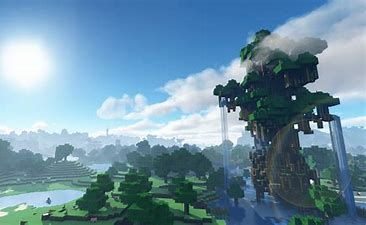

<html>           
<head>  
<link rel = "icon" href = 
       "2.jpeg">
</head>
<body style= "background-repeat: no-repeat;background-size: 100% 100%" background="hd.jpg" text="#0000ff">
<title>Page Title</title>

 <h1 align="center">  Hi, I'm SREEHAN!!  </h1> 

 <h2> 
 Welcome to my website! 
 </h2> 

 

Click this button so that I can say something!

<button type="button" onclick="myFunction()">Try it</button> 

<h2 align="center">  I'm a programmer!  </h2>
  &#128512; 

<h2> 
  I do programming like Python, QBASIC, HTML etc.  
 </h2>

<h2> 
  I play modded games like modded minecraft, my favourite game.  
 </h2>
<h2> 
  In that game, it mostly looks kink of normal, but when you add Nvidia RTX graphics card to it , Minecraft looks very realistic.(looks how everything is in real life)!! Like in the below image. And just igore the clouds because they only come in mods   
 </h2>

  

<h2> 
  Second favourite game is Blockman go_Bed-Wars, it is very fun to play as it is available in phones  
 </h2>

<h2> 
 My faourite thing is Space!!! There are so many thing and so much to discover it. 
 </h2>
<h2> 
  It is my favourite subject! I know billions of thing that are in space like Gamma Rays, Super and Hyper-novas; Oort Cloud, Space wars, etc!  
 </h2>
 
 
                                                                                                                                       
            <h3 class="contact-title">Do you want to chat to me? Okay, fine, here it is!</h3>
       
Email here!

       <a class="btn" href="mailto:asreehan@outlook.com">CONTACT ME</a>
          
 
          
 

              
  <h2> 
 A fun fact!=In another billion years, our Milky Way will collide with the Andromeda Galaxy and form (Andro-Way) or (Milkymeda)!?!? 
 </h2>  

 <svg height="200" width="500">
  <defs>
    <linearGradient id="grad1" x1="10%" y1="0%" x2="100%" y2="0%">
      <stop offset="0%"
      style="stop-color:rgb(255,255,0);stop-opacity:1" />
      <stop offset="100%"
      style="stop-color:rgb(255,0,0);stop-opacity:1" />
    </linearGradient>
  </defs>
  <ellipse cx="100" cy="70" rx="85" ry="55" fill="url(#grad1)" />
  <text fill="#ffffff" font-size="35" font-family="Verdana"
  x="50" y="80">THANK YOU</text>
</svg> 

     
                                                                                                                                          
